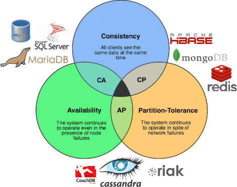

# Made a mistake today

Today I maade a small mistake that has occured before and i keep doing it.

While working with an outside resource to start doing testing on what was supposed to be a small change for a client i misunderstood how the API i was working on worked and confused the resource that was assigned to do QA testing with me.

For context i was working on an order booking API for a shipping company.
I was tasked with adding in a text Opt-in field to an existing booking API. I did this correctly but i misunderstood how the previous developer who created this API implemented how phone numbers were absorbed through the API. In the process i told the client who i was testing with that we would have to make an additional change to the API in order to add in the ability to intake phone numbers.

Later my manager corrected me to check carefuly again because we already did have a way to intake phone numbers. Low and behold i checked the code written by the previous developer and they did intake phone numbers but in a weird way.

The previous developer did not add the phone number as a straight forward field like:

```json
{
    "phone":"4432343434"
}
```
They implemented this by having a field called `additionalInfo` where the phone field is defined as:
```json
{
    "additionalInfo":"Customer phone: 4435348250"
}
```
Where a seperate function then parsed the left side of the `:` to check if the name found was "customer phone" which was then used as the customers phone number.

Needless to say I made a mistake by not doing my research and jumping into my own conclusions about how the code worked. Try not to do this again.

# New things learned

### Cap Theorem


Learned about CAP theorem which spells out the relationship between consistency, availability and partition tolerance in databases. You cant have all 3 and some services leverage a combination of 2 of the 3 parts of the cap theorem.

Learned about ACID in terms of databases

**Atomicity**: This property ensures that a transaction is treated as a single, indivisible unit of work. Either all the changes made in a transaction are applied, or none of them are. If any part of the transaction fails, the entire transaction is rolled back to its previous state.

**Consistency**: The consistency property ensures that a transaction brings the database from one valid state to another. It enforces integrity constraints, ensuring that the database remains in a consistent state before and after the execution of a transaction.

**Isolation**: Isolation ensures that the execution of one transaction is isolated from the execution of other transactions. This means that the intermediate state of a transaction is not visible to other transactions until the transaction is committed. Isolation prevents interference between concurrent transactions.

**Durability**: Durability guarantees that once a transaction is committed, its effects are permanent and survive subsequent system failures. The changes made by a committed transaction are stored in a durable storage medium (e.g., hard disk), ensuring that they persist even in the event of power outages or system crashes.


Also learned what the relationship between C, C++, Java, and C#.

C was a functional programming language. C++ was created to solve issues with C which also introduced object oriented programming. Java was introduced to solve the issue of C,C++ only running on one system and also introduced garbage collection.